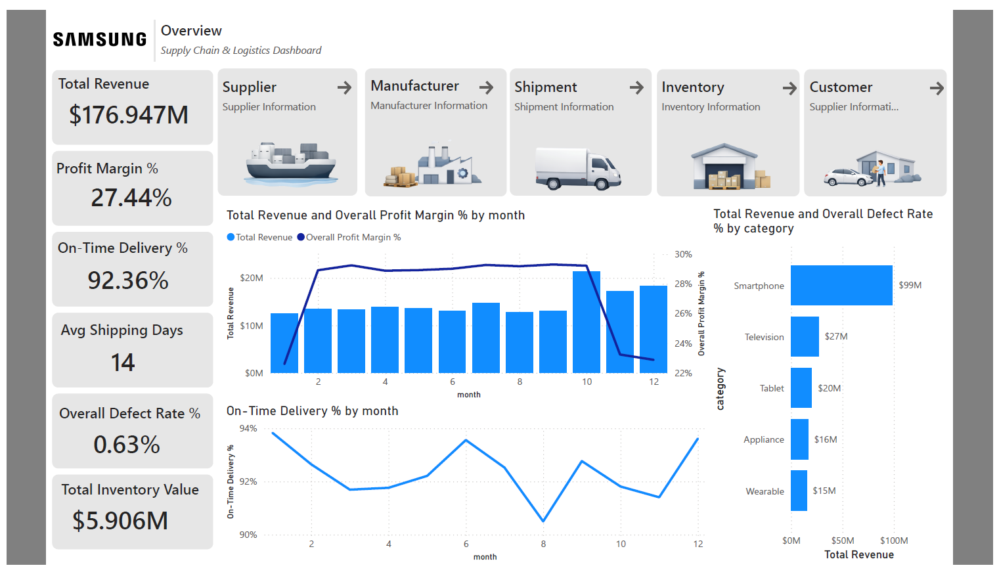
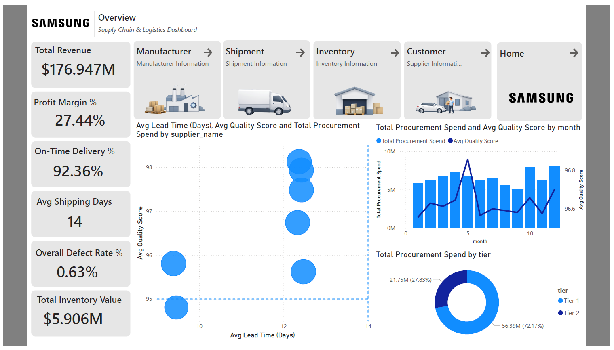

# Enterprise Supply Chain & Sales Performance Dashboard

**Tool Used:** Power BI  
**Techniques:** Star Schema Data Modeling, Advanced DAX, KPI Design, Conditional Formatting

## 📌 Project Overview
This project is an end-to-end Power BI dashboard designed for executive oversight of a global supply chain and sales operation. It transforms raw transactional data across 10 distinct tables into a fully interactive, 6-page reporting suite. 

The dashboard provides a "Balanced Scorecard" view, allowing stakeholders to track top-line revenue, evaluate supplier reliability, monitor factory defect rates, and prevent critical inventory stockouts.

## 📊 Dashboard Previews

### 1. Executive Home Overview
A high-level health check of the business, featuring a fixed KPI header strip and a 4-quadrant view of Financials, Products, Reliability, and Geographic reach.

### 2. Supplier & Procurement Performance
An actionable view for the Purchasing team, featuring a Supplier Matrix that plots Lead Time against Quality Score to immediately identify the best and worst vendor partners.

*(Note: Download the `.pbix` or view the PDF export in this repo to see the Manufacturing, Logistics, Inventory, and Customer pages).*

## 🧠 The Data Model (Star Schema)
The foundation of this report is a robust **Star Schema** designed for optimal DAX performance.
* **Fact Tables:** `fact_sales`, `fact_shipment`, `fact_production`, `fact_procurement`, `fact_inventory`
* **Dimension Tables:** `dim_product`, `dim_supplier`, `dim_facility`, `dim_customer`, `dim_date`
* **Relationships:** Strictly `1-to-Many (*:1)` with single-directional filtering from Dimensions to Facts to prevent ambiguity.

## ⚙️ Advanced DAX Implementations
Instead of relying on basic aggregations, this model uses complex DAX to solve real-world business logic problems:

* **Semi-Additive Inventory Logic:** Prevented the false summation of historical stock by utilizing `LASTNONBLANK` to calculate the accurate stock on hand at the end of the selected period.
* **Dynamic Stock Alerts (Traffic Light System):** Built a nested `SWITCH(TRUE())` measure comparing 'Current Stock' against 'Reorder Points' and 'Safety Stock' to automatically flag items as "OK", "WARNING", or "CRITICAL".
* **On-Time Delivery %:** Calculated logistics reliability by evaluating text-based `status` columns against total row counts dynamically.
* **First Pass Yield & Defect Rates:** Avoided Simpson's Paradox by properly dividing total defective units by total produced units at the aggregate level.

## 📑 Report Pages & Key Insights
1. **Home:** Fixed 6-KPI strip (Revenue, Margin, On-Time %, Shipping Days, Defect Rate, Inventory Value) synced across all pages.
2. **Inventory:** Identifies capital tied up in stock and highlights products at immediate risk of stocking out.
3. **Supplier:** Evaluates vendor spend against lead times and quality scores.
4. **Manufacturing:** Tracks factory capacity utilization and flags locations/products driving high defect rates.
5. **Shipment:** Analyzes carrier performance, root causes of delays, and shipping cost trends.
6. **Customer:** Highlights the "Whales" (high revenue/high margin) vs. unprofitable accounts driven by excessive discounts.

## 📂 Repository Contents
* `Supply_Chain_Sales_Dashboard.pbix`: The fully functional Power BI project file.
* `Dashboard_Presentation.pdf`: A PDF export for quick viewing of all 6 pages.
* `Data/`: The 10 raw CSV files used to build the model.
* `DAX_Measures.md`: A text file containing the complex DAX formulas used in the project.
